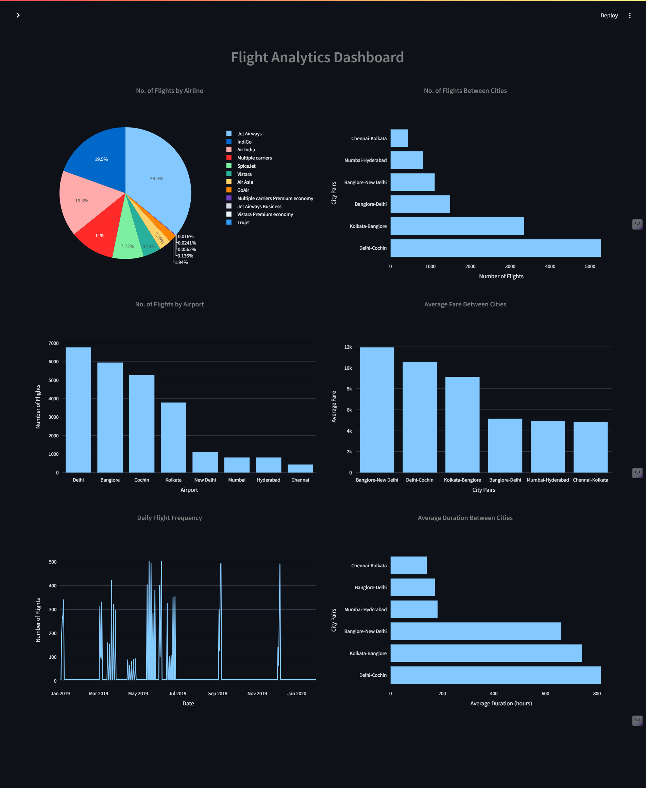

# Flight-Dashboard-with-python-Mysql-streamlit

## Introduction
Welcome to the **Flight Analytics Dashboard**! This Streamlit app is designed to provide an insightful and interactive way to explore flight data and trends. Whether you’re a travel enthusiast, a data analyst, or just curious about flight patterns, this dashboard offers a comprehensive overview of various aspects of flight information.

### Key Features

- **Flight Analytics**: Gain insights into flight patterns with interactive visualizations. Analyze how many flights belong to each airline, the number of flights from different airports, and daily flight frequencies.
- **Flight Comparisons**: Explore detailed comparisons, such as the number of flights between cities, average fare, and average flight duration. These visualizations help in understanding the connectivity and cost dynamics of different routes.
- **Search Flights**: Use the search functionality to find flights between cities on a specific date. This feature helps users quickly retrieve and review flight information based on their travel plans.

### Visualizations Include

- **Pie Charts**: Display the distribution of flights across different airlines.
- **Bar Charts**: Show the number of flights from various airports and comparisons of flight metrics between cities.
- **Line Charts**: Illustrate the number of flights on a daily basis over time.

### How to Use

1. **Navigate**: Use the sidebar to select between different sections: Home, Search Flights, and Analytics.
2. **Explore**: View interactive charts and graphs under the Analytics section to explore flight data.
3. **Search**: Enter your source and destination cities along with the travel date to find available flights.

### Technologies Used

- **Streamlit**: For building and deploying the interactive web app.
- **Plotly**: For creating interactive and visually appealing charts and graphs.
- **Python**: The primary programming language used for data processing and visualization.

I hope you find this app useful and informative. If you have any questions or feedback, feel free to reach out!

## Demo & Screenshots
| **Home page** | **Search Flights** |
|:--:|:--:|
|  |  |

  <h2>Flight Analytics Dashboard</h2>

